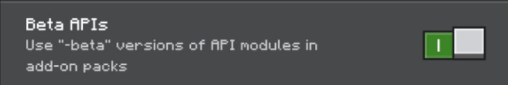

# LandLocker: Bedrock Edition

This is a Minecraft Bedrock Edition Add-On that is inspired by [GriefPrevention](https://legacy.griefprevention.com/) to give players the right to claim a land that prevents other unauthorize players or damage to cause any griefs in the claimed land.

## Instalation
First, you must download the LandLocker pack that you can find in the [release section](https://github.com/IndeedItzGab/LandLocker/releases/). After that, import it with your minecraft. Once it's imported, you can now apply it to a world or realm. The "BETA APIs" experimental feature must be enabled.

[Proper Instructions for installation.](docs/INSTRUCTION.md)
You can now play with the the LandLocker!

## Feature
While we currently developing LandLocker, these are the following available features:
- Claim a land.
- Resizing the land with a Golden Shovel.
- Protects your land from explosions, destroying blocks, placing blocks, and interacting with blocks and mobs.
- Trust a player if they can do anything in your land, access your containers like chests, let them only use the buttons and levers, or grant them a permission to share their level of permissions.
- Combat is disabled to a player with a empty inventory.
- Custom slash commands, see [Commands List](docs/COMMANDS.md)

more features will be added in the near future!

## Frequently Asked Questions
You can checkout this [FAQ page](docs/FAQ.md) for questions that is commonly asked related to this project.

## Contributions
### Reporting Bugs
If you encounter any bugs while using LandLocker, please open an [issue](https://github.com/IndeedItzGab/LandLocker/issues/new) in our github repository. Ensure to include a detailed description of the issue and steps to reproduce it.
### Submitting a Pull Request
We appreciate code contribution for this project. Especially if you have fixed a bug or implemented a new feature, you may submit a pull request.
Please ensure your code follows our coding standard and includes tests where possible.

## Copyright
© 2025 IndeedItzGab. All rights reserved.
- You may not distribute this project without explicit permission and proper credit.
- You may modify this project for **personal use only**.

## Support
It took time for me to make this project by myself, so if you want to support me, you can donate in my [PayPal](https://www.paypal.me/GabrielBondoc09)

## Contact
- Discord Server: https://discord.gg/23vG3Np6AH
- Twitter/X: https://x.com/IndeedItzGab?t=UL3bhR8CksHJSWn89duhuA&s=09